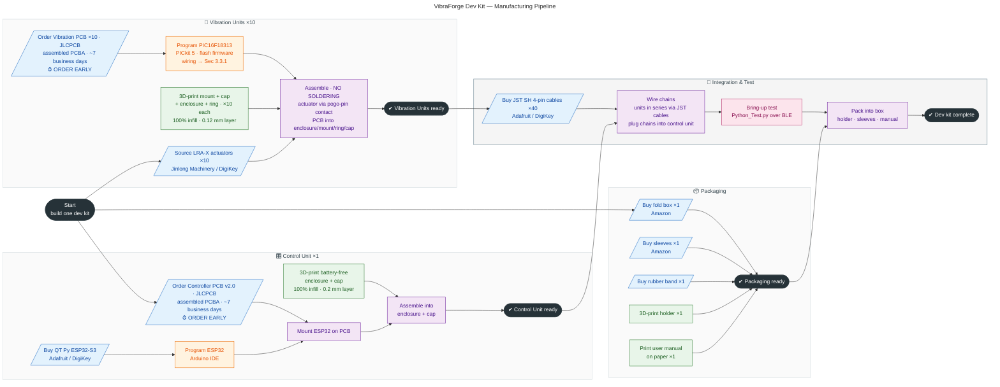
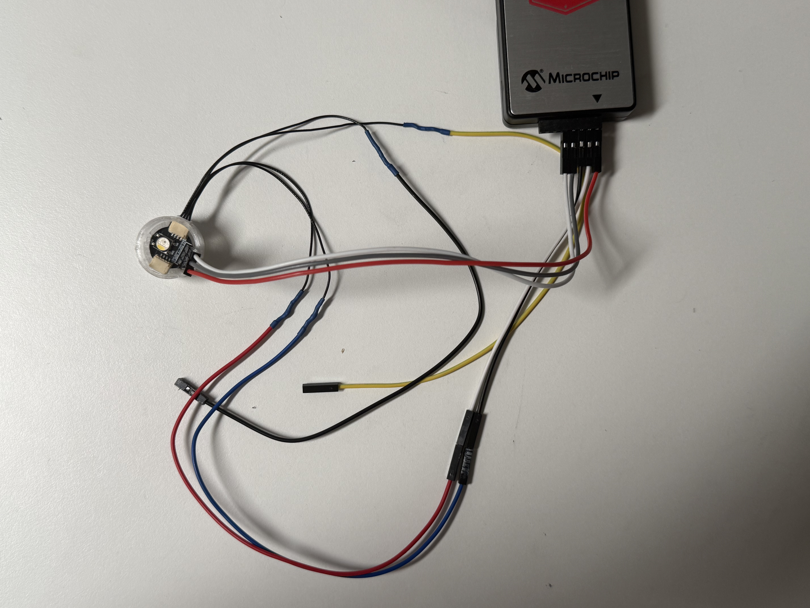

# Manufacturing Guide

This document describes how to manufacture one **VibraForge** development kit end-to-end, so you can build a working spatialized vibrotactile system yourself. It covers PCB ordering, component sourcing, firmware programming, 3D-printed parts, and final assembly.

This guide targets the **standard dev-kit configuration**:

- **Control Unit** — 1×, based on the **Adafruit QT Py ESP32-S3** (the "Small" control unit). A Bluetooth hub that drives up to four serial chains of actuators.
- **Vibration Units** — 10×, each a PIC-microcontroller driver board carrying one **LRA-X** actuator (linear resonant actuator, in-plane axis). Units are daisy-chained; each chain supports up to 16 units.
- **Packaging** — box, holder, sleeves, and printed manual for shipping a complete kit.

> Source files: PCB + firmware in [Electrical_Design/](Electrical_Design/), CAD in [Mechanical_Design/](Mechanical_Design/).

---

## 1. Manufacturing Pipeline (DAG)

The three sub-assemblies — **Packaging**, **Control Unit**, and **Vibration Units** — are fully independent and can be built in parallel. They converge only at final kit assembly and bring-up test.



**Critical path:** the two JLCPCB orders (Controller PCB and Vibration PCBs) have the longest lead time at **~7 business days** — place both first, then print 3D parts, buy off-the-shelf items, and program firmware while you wait.

---

## 2. Bill of Materials (one dev kit)

> The full parts list is also available as a spreadsheet: [VibraForge Dev Kit BOM.csv](VibraForge%20Dev%20Kit%20BOM.csv).
>
> **Filament:** print the packaging **holder** in [matte PLA](https://www.amazon.ca/dp/B0FD1LFGZT); print **all other parts** (control-unit and vibration-unit enclosures, caps, mounts, rings) in [transparent PLA](https://www.amazon.ca/dp/B0FGD7DJ4K).

### Packaging
| Item | Qty | Source |
|------|-----|--------|
| Fold box | 1 | [Amazon](https://www.amazon.ca/dp/B08G8CLKNH) |
| Sleeves | 1 | [Amazon](https://www.amazon.ca/dp/B0DGQ37KB7) |
| Rubber band | 1 | Any |
| 3D-print holder | 1 | Print in-house |
| User manual | 1 | Paper print |

### Control Unit (×1)
| Item | Qty | Source |
|------|-----|--------|
| Controller PCB v2.0 (assembled) | 1 | JLCPCB (PCBA) |
| Adafruit QT Py ESP32-S3 | 1 | [Adafruit #5426](https://www.adafruit.com/product/5426) / DigiKey |
| 3D-print enclosure (battery-free) | 1 | Print in-house |
| 3D-print cap (battery-free) | 1 | Print in-house |

### Vibration Unit (×10)
| Item | Qty | Source |
|------|-----|--------|
| LRA-X actuator | 10 | Jinlong Machinery / [DigiKey JYLRA9595X](https://www.digikey.com/en/products/detail/jie-yi-electronics-limited/JYLRA9595X/22519430) — for bulk orders, contact the author |
| Vibration PCB (assembled) | 10 | JLCPCB (PCBA) |
| 3D-print mount | 10 | Print in-house |
| 3D-print cap | 10 | Print in-house |
| 3D-print enclosure | 10 | Print in-house |
| 3D-print ring | 10 | Print in-house |
| STEMMA QT / Qwiic JST SH 4-pin cable, 100mm | 40 | [Adafruit #4210](https://www.adafruit.com/product/4210) / DigiKey |

### Miscellaneous (tools — one per builder, not per kit)
| Item | Qty | Source |
|------|-----|--------|
| MPLAB PICkit 5 programmer | 1 | [DigiKey PG164150](https://www.digikey.com/en/products/detail/microchip-technology/PG164150/19915398) |

> Both PCBs are ordered **fully assembled (PCBA)** from JLCPCB, so no hand-soldering of SMT components is required. The orderable BOM and placement files are provided for both boards:
> - Small Control Unit: [Board_Small_Unit_BOM.csv](Electrical_Design/Control_Unit/Small_Unit/Board_Small_Unit_BOM.csv), [Board_Small_Unit_CPL.csv](Electrical_Design/Control_Unit/Small_Unit/Board_Small_Unit_CPL.csv)
> - LRA Vibration Unit: [Board_LRA_BOM.csv](Electrical_Design/Vibration_Unit/Board_LRA/Board_LRA_BOM.csv), [Board_LRA_CPL.csv](Electrical_Design/Vibration_Unit/Board_LRA/Board_LRA_CPL.csv)

---

## 3. Step-by-Step Manufacturing

### 3.1 Packaging

All three sub-assemblies are independent — packaging can be prepared any time.

1. **Buy** the fold box, sleeves, and a rubber band (see BOM links).
2. **3D-print** the packaging holder (1×).
3. **Print the user manual** on paper.
4. Set these aside for final kit assembly (§3.5).

### 3.2 Control Unit (×1)

1. **Order the Controller PCB v2.0** from [JLCPCB](https://jlcpcb.com/) as an **assembled PCBA** — upload the Gerber, BOM, and CPL from [Small_Unit/](Electrical_Design/Control_Unit/Small_Unit/) so JLCPCB places all components. **Lead time ~7 business days — order this first.**
2. **Buy the Adafruit QT Py ESP32-S3** ([#5426](https://www.adafruit.com/product/5426), Adafruit or DigiKey).
3. **3D-print** the **battery-free** control-unit enclosure and cap — [Enclosure_Battery_Free.stl](Mechanical_Design/Control_Unit_Small/Enclosure_Battery_Free.stl) and [Cap_Battery_Free.stl](Mechanical_Design/Control_Unit_Small/Cap_Battery_Free.stl) — normal settings with **100% infill** and a regular **0.2mm layer height**. The unit is powered over USB. The folder also contains the older `*_with_Battery` variant, which the dev kit does not use (see the [Mechanical Design readme](Mechanical_Design/readme.md)).
4. **Program the ESP32 with Arduino IDE** (see §3.2.1).
5. **Assemble:** mount the programmed ESP32 onto the controller PCB, then fit the PCB into the enclosure and close with the cap.
6. **Orientation matters:** the four chain connectors must be installed in the correct order and the **USB port must face left** — see [Figures/control_unit.png](Figures/control_unit.png). Reversing a connector can short the ESP32.

#### 3.2.1 Control Unit Firmware (Arduino)

1. Install the [Arduino ESP32 core](https://github.com/espressif/arduino-esp32) and the [ESP32 SoftwareSerial](https://github.com/plerup/espsoftwareserial) library. The sketch also uses `ArduinoJson` and `Adafruit_NeoPixel`.
2. Open [BLE_peripheral_QTPyS3.ino](Electrical_Design/Control_Unit/Main_Program_Arduino/BLE_peripheral_QTPyS3/BLE_peripheral_QTPyS3.ino).
3. Note the BLE identifiers — these must match your host software:
   - `SERVICE_UUID = f10016f6-542b-460a-ac8b-bbb0b2010599`
   - `CHARACTERISTIC_UUID = f22535de-5375-44bd-8ca9-d0ea9ff9e410`
   - Device name: `QT Py ESP32-S3`
4. The four chains are driven on `subchain_pins = {18, 17, 9, 8}`.
5. Select the QT Py ESP32-S3 board and upload over USB. If it misbehaves, [factory-reset the board](https://learn.adafruit.com/adafruit-qt-py-esp32-s3/factory-reset).

### 3.3 Vibration Units (×10)

1. **Source the LRA-X actuators** (10×) from **Jinlong Machinery**, or buy from [DigiKey (JYLRA9595X)](https://www.digikey.com/en/products/detail/jie-yi-electronics-limited/JYLRA9595X/22519430). For bulk orders, contact the author.
2. **Order the Vibration PCBs** (10×) from JLCPCB as **assembled PCBA** — upload the Gerber, BOM, and CPL from [Board_LRA/](Electrical_Design/Vibration_Unit/Board_LRA/). **Lead time ~7 business days — order early.**
3. **Buy the JST cables:** STEMMA QT / Qwiic JST SH 4-pin, 100mm (40× — [Adafruit #4210](https://www.adafruit.com/product/4210) or DigiKey). These form the chain links.
4. **3D-print** all four parts — mount, cap, enclosure, ring (10× each) — normal settings with **100% infill** and **0.12mm layer height** (files in [Vibration_Unit_LRAX/](Mechanical_Design/Vibration_Unit_LRAX/)).
5. **Program each PIC16F18313 MCU** with the PICkit 5 (§3.3.1). The same firmware is flashed to every unit — no per-unit address to set.
6. **Assemble — no soldering required!** The LRA-X actuator makes contact with the PCB via **pogo pins**. Seat the actuator, PCB, mount, and ring into the enclosure and close with the cap; the ring/mount hold the actuator against the pogo-pin contacts.
7. **Orientation matters:** with the programming pins on top, **input is on the left, output on the right**. Do not reverse — the driver board can be damaged by a short. See [Figures/vibration_unit.png](Figures/vibration_unit.png).
8. **Status LED (debug aid):** each board has one RGB NeoPixel. It is off while idle and lights up when the board receives a "Start" command and should be vibrating, with the color indicating the intensity level. It does not indicate power on its own.

#### 3.3.1 Vibration Unit Firmware (PICkit 5)

The **same firmware** runs on every vibration unit: [Vibration_Unit.c](Electrical_Design/Vibration_Unit/Main_Program_MPLABXIDE/Vibration_Unit.c) plus the NeoPixel driver [neopixel_control.c](Electrical_Design/Vibration_Unit/Main_Program_MPLABXIDE/neopixel_control.c) / [neopixel_control.h](Electrical_Design/Vibration_Unit/Main_Program_MPLABXIDE/neopixel_control.h) (PIC16F18313, 32 MHz HFINTOSC). There is **no per-unit address to program** — a unit's address is determined automatically by its position in the chain at runtime (chain 1 → 0–15, chain 2 → 16–31, etc.).

1. Install [MPLAB X IDE](https://www.microchip.com/en-us/tools-resources/develop/mplab-x-ide) and connect the [PICkit 5](https://www.digikey.com/en/products/detail/microchip-technology/PG164150/19915398).
2. Connect the PICkit 5 programming wires to the header on the **top** of the vibration PCB as shown below:

   

3. Create an MPLAB X project for the PIC16F18313 with the XC8 compiler and add `Vibration_Unit.c`, `neopixel_control.c`, and `neopixel_control.h` (not the standalone programs in `tests/`). Build and flash the firmware to each of the 10 boards. Every board gets the identical program.

### 3.4 Chain Wiring & Bring-up Test

1. **Daisy-chain the vibration units:** connect each unit's **output** to the next unit's **input** using the JST SH cables, keeping input-left / output-right orientation consistent.
2. Plug each chain's first unit into the corresponding chain connector on the control unit (respect connector order, §3.2).
3. Power the control unit via USB.
4. **Bring-up test** — install `pip install bleak`, then from [Software_Design/Python_Server/](Software_Design/Python_Server/):
   ```bash
   python Python_Test.py -uuid f22535de-5375-44bd-8ca9-d0ea9ff9e410 -name "QT Py ESP32-S3"
   ```
5. Send a command to a known address and confirm the target unit's NeoPixel lights up and it vibrates.

### 3.5 Final Kit Assembly

1. Place the tested control unit and 10 vibration units into the 3D-printed holder.
2. Add the sleeves and secure with the rubber band.
3. Insert the printed user manual and pack everything into the fold box.

Once verified, the kit can be driven with the [GUI Editor](GUI_Editor/), the [Unity API](Software_Design/Unity_Engine_API/), or [Python_Play_Command.py](Software_Design/Python_Server/Python_Play_Command.py).

---

## 4. Quick Checklist

**Order early (long lead time):**
- [ ] Controller PCB v2.0 — JLCPCB assembled (~7 business days)
- [ ] Vibration PCBs ×10 — JLCPCB assembled (~7 business days)

**Control Unit**
- [ ] QT Py ESP32-S3 purchased
- [ ] Battery-free enclosure + cap printed (100% infill, 0.2mm)
- [ ] ESP32 flashed with Arduino firmware
- [ ] Assembled (USB faces left, connector order verified)

**Vibration Units (×10)**
- [ ] LRA-X actuators sourced (Jinlong / DigiKey)
- [ ] Mount / cap / enclosure / ring printed (100% infill, 0.12mm)
- [ ] Each PIC flashed with firmware (PICkit 5, no address to set)
- [ ] Assembled — no soldering (pogo-pin actuator contact, input-left/output-right)

**Packaging**
- [ ] Fold box + sleeves + rubber band bought
- [ ] Holder printed, manual printed

**Integration**
- [ ] JST cables ×40 purchased
- [ ] Chains wired and plugged into control unit
- [ ] Passed `Python_Test.py` bring-up test
- [ ] Packed into box

Have fun building the toolkit! If you hit a problem, open an issue in the repository.
